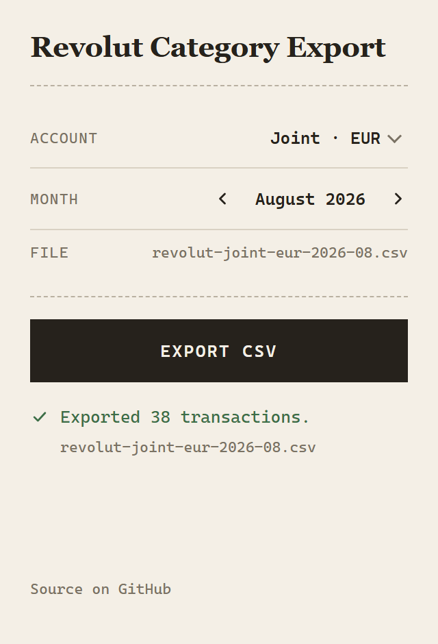

# Revolut Category Export


**Revolut's own CSV and PDF exports drop the category you assigned to every transaction.
This extension puts it back.**

<p align="center">
  
</p>

If you categorise your spending in the Revolut app and then export it, the work vanishes —
every row comes out uncategorised and you re-do it by hand in a spreadsheet.

The categories are not lost. They are returned by the same API the Revolut web app itself
uses, and dropped only on the export path. This extension reads them from the session you
are already logged into, and writes a CSV with a `Category` column.

## What you get

A CSV carrying the same transaction fields as Revolut's own export, plus three it does
not give you: **`Category`**, your in-app **`Comment`**, and a stable **`Transaction ID`**.

```csv
Type,Started Date,Completed Date,Description,Amount,Fee,Currency,State,Balance,Category,Comment,Transaction ID
CARD_PAYMENT,2026-08-14 09:12:03,2026-08-15 10:31:44,Corner Store,-12.40,0.00,EUR,COMPLETED,842.19,groceries,,11111111-1111-4111-8111-111111111111
TRANSFER,2026-08-12 18:02:55,2026-08-13 02:44:10,To Flatmate,-35.00,0.00,EUR,COMPLETED,854.59,transfers,August bills,22222222-2222-4222-8222-222222222222
TOPUP,2026-08-01 08:00:11,2026-08-01 08:00:13,Top-Up by *1234,500.00,0.00,EUR,COMPLETED,889.59,topup,,33333333-3333-4333-8333-333333333333
```

Amounts are written as decimal strings, never floats, so nothing is silently rounded.
Timestamps are rendered in your own timezone. The file is UTF-8 with a BOM, so Excel
opens accented merchant names correctly on the first try.

## Install

No build step, no dependencies, nothing to compile.

1. Download or clone this repository.
2. Open `chrome://extensions` and turn on **Developer mode** (top right).
3. Click **Load unpacked** and select the repository folder — the one containing
   `manifest.json`, not the `extension` subfolder.
4. Pin it from the puzzle-piece menu so you can find it.

Chrome 105 or newer, or an equivalent Chromium browser — Edge, Brave, Arc. Manifest V3
itself landed earlier, but the popup's stylesheet uses `:has()`, which needs 105. Exporting
works from there on; the popup also uses `mask` and `text-wrap: pretty`, so below Chrome 120
the success tick shows as a plain square. Firefox is not supported.

## Use

1. Log in at [app.revolut.com](https://app.revolut.com) as you normally would.
2. Click the extension icon.
3. Pick an account and a month, then **Export CSV**.

Personal accounts, joint accounts, and each currency pocket are all selectable
separately. An account the extension cannot read is still listed, marked, and greyed out
— rather than quietly missing, which would look like it wasn't supported.

## Privacy

This reads your bank account, so the claims below are all things you can verify rather
than take on trust.

- It talks to **`app.revolut.com` and nowhere else**. That comes from the code: there is
  a single network call site and a single hard-coded origin, both in `src/core/http.js`.
  `host_permissions` in `manifest.json` names that one host too, which is what bounds
  which cookies the extension may read and which requests may carry them — note that it
  is not an egress firewall, so the guarantee rests on the code, which is why the code is
  small enough to read. CI fails the build if a second host appears, or if
  `host_permissions` changes.
- **No analytics, no telemetry, no error reporting, no update pings.**
- It issues **GET requests only**. It cannot move money — that is a property of the code,
  not a promise. The extension has exactly one network call site, `src/core/http.js`,
  whose method is the literal `'GET'`. (`spike/snippet.js` also fetches, but it is a
  diagnostic you paste into DevTools yourself; it is not loaded by the extension.)
- It never handles your passcode. It reuses the browser session you established by
  logging in normally.
- It reads exactly **one** cookie, `revo_device_id`, because Revolut's API requires its
  value as an `x-device-id` header. That cookie is a device identifier, not a credential.
  It is requested by name, and there is a single `chrome.cookies.get` call in the whole
  codebase:

  ```bash
  grep -rn "chrome.cookies" extension/ src/
  ```

  Being honest about the limit of that: the `cookies` permission this extension holds
  *would* let it read your session cookies, including `HttpOnly` ones that page
  JavaScript cannot touch. It doesn't. But that is a property of the code you can read,
  not something the browser enforces for you — so read it.
- Everything runs locally. Your transactions are never sent anywhere.

## How it works

`GET /api/retail/wallets` lists your accounts. `GET /api/retail/user/current/transactions/last`
returns transactions, each carrying a `category` field.

Two wrinkles explain most of the code:

**Accounts are addressed inconsistently, and a wrong address fails silently.** Personal
pockets answer to an `internalPocketId`; a joint account answers only to a `walletId`, and
returns `200` with an *empty array* for the other. An unrecognised parameter is ignored
entirely, and the API cheerfully returns a different account's transactions. So the
extension **probes** each account to find the parameter that returns *that account's* rows,
and refuses any that returns someone else's. Getting this wrong doesn't produce an error —
it produces a spreadsheet that looks perfectly fine and describes the wrong account.

**A wallet-wide query returns every pocket in that wallet**, including savings pockets the
account list doesn't even enumerate. Rows are filtered down to the pocket you selected, so
the file matches Revolut's own per-account export. One consequence: savings interest is
not included.

Month membership follows the **completion** date, matching Revolut's statements. A payment
made on the 31st that clears on the 1st belongs to the following month — which is what
makes an export's totals agree with the statement for the same period.

**Completeness is checked, not assumed.** Every transaction carries the account balance
immediately after it settled, so consecutive rows have to add up. If they don't, a
transaction is missing and the export raises instead of writing the file. That check does
not depend on any assumption about how the API pages, which matters because the API is
undocumented and several such assumptions have turned out to be wrong.

See [docs/api-notes.md](docs/api-notes.md) for everything observed about the API.

## Troubleshooting

| What you see | What it means |
| --- | --- |
| *No Revolut session found* | You're not logged in to `app.revolut.com` in this browser profile. Log in, then reopen the popup. |
| *Your Revolut session has expired* | Reload `app.revolut.com` and log in again. |
| An account marked *[unverified]* | Probing it returned no transactions of its own, so the extension could not confirm it reads the right account. Exporting still works; check the first file against the app. |
| An account marked *can't be read* | No query parameter returned that account's own rows. It is listed rather than hidden so you know it exists. |
| *returned no transactions for this month* | Nothing is written, deliberately. An empty CSV reads as a quiet month rather than a failure. |
| Everything fails at once | Revolut may have shipped a new web client. Run `spike/snippet.js` in the DevTools console on a logged-in tab; it reports what the API is doing now, to compare against `docs/api-notes.md`. |
| *Transactions are missing…* or *Refusing to write…* | The export stopped rather than write a file it could not prove complete — the balances did not line up, or paging could not reach the whole month. Nothing is written, and nothing is wrong with your account. This is a bug worth reporting: open an issue with the message and the output of `spike/snippet.js`. |

## Development

```bash
npm test
```

Node 20+. The suite uses Node's built-in test runner — there are no dependencies, runtime
or development, because this touches banking data and every dependency is supply-chain
surface. Fixtures are synthetic; no real account data is in this repository.

To check an export against Revolut's own statement export:

```bash
node scripts/reconcile.mjs ours.csv official.csv
```

It does a per-row diff, so a mismatch tells you *which* rows differ rather than just that
the totals disagree. Revolut's own export has no transaction id column, so the two sides
are keyed on id only when both files carry one, and on date, amount and description
otherwise. Equal row counts and an equal total are not treated as a match on their own —
one row substituted for another clears both of those.

## Contributing

Issues and pull requests are welcome. Two constraints before you open one:

- **`npm test` must pass.** It needs no install step, so there is no excuse.
- **No dependencies, ever** — not runtime, not development, not a linter or a test
  framework. This reads a bank account, and every dependency is code a user would have to
  trust without reading. That constraint is the reason the project can honestly ask people
  to read it instead.

If you are reporting a breakage, run `spike/snippet.js` in the DevTools console on a
logged-in tab first and say what it printed. That distinguishes a change in Revolut's API
from a bug here, and it is the single most useful thing to include.

Security issues go to [SECURITY.md](SECURITY.md) rather than a public issue.

## Caveats

This uses **undocumented internal endpoints**. It is not affiliated with, endorsed by, or
supported by Revolut, and it may break without notice whenever they ship a new web client.
It is read-only and cannot move money.

## Licence

MIT — see [LICENSE](LICENSE).
